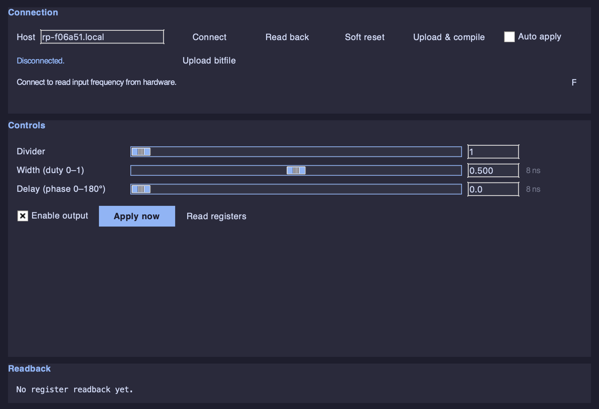

# Red Pitaya Frequency Divider — Control GUI

A Python/tkinter desktop GUI to control a custom frequency divider/pulse generator implemented on the Red Pitaya FPGA (STEMlab 125-14). The FPGA core measures the period of an external input signal, divides its frequency, and outputs a configurable pulse with controllable width and phase delay.



```
External signal ──► DIO0_P ──► [FPGA: freq divider + pulse gen] ──► DIO1_P ──► Output pulse
                                              ▲
                                     SSH (this GUI)
```

## Hardware

- **Board:** Red Pitaya STEMlab 125-14
- **Tested OS:** Red Pitaya OS 2.07-48
- **FPGA clock:** 125 MHz
- **Input:** pin `DIO0_P` / `GND` (E2 connector)
- **Output:** pin `DIO1_P` / `GND` (E2 connector)
- **Input frequency range:** 1 Hz – 300 kHz
- **Divider range:** 1–32

### Register map (AXI base `0x40600000`)

| Offset | Register        | Description                                          |
|--------|-----------------|------------------------------------------------------|
| 0x00   | control         | Bit 0 = output enable, Bit 1 = soft reset            |
| 0x04   | divider         | Frequency divider value (1–32)                       |
| 0x08   | pulse width     | Pulse width in 125 MHz clock cycles                  |
| 0x0C   | delay           | Pulse delay in 125 MHz clock cycles                  |
| 0x10   | status          | Bit 0 = busy, Bit 1 = period_valid, Bit 2 = timeout  |
| 0x14   | raw period      | Last raw measured input period (cycles)              |
| 0x18   | filtered period | Filtered measured input period (cycles)              |

Input frequency is measured directly from the hardware — no manual entry needed.
Frequency from period: `freq_hz = 125_000_000 / period_cycles`

## Repository Contents

| File | Description |
|------|-------------|
| `redpitaya_pulse_gui_c_helper.py` | Desktop GUI — run on your PC |
| `rp_pulse_ctl.c` | C helper binary — compiled on the board via the GUI |
| `red_pitaya_top.bit.bin` | FPGA bitfile — download from [Releases](../../releases) and place next to the GUI script |

## Requirements

**PC:**
- Python 3 with `tkinter` (standard library, no pip install needed)
- OpenSSH client (`ssh`, `scp`)
- macOS, Linux, or Windows with OpenSSH

**Red Pitaya:**
- OS 2.07-48 (other versions may work)
- SSH access as `root`
- `gcc` available on the board
- `fpgautil` at `/opt/redpitaya/bin/fpgautil`

## Getting Started

### 1. Find your board hostname

Each Red Pitaya has a unique hostname printed on the board sticker, in the form `rp-XXXXXX.local`. You can also find it by scanning your network or connecting via the Red Pitaya web interface. Update the **Host** field in the GUI accordingly.

### 2. Run the GUI

```bash
python3 redpitaya_pulse_gui_c_helper.py
```

### 3. First-time setup

If the C helper binary is not yet on the board, click **Upload & compile** — this copies `rp_pulse_ctl.c` via SCP and compiles it on the board with `gcc`.

If the FPGA bitfile needs updating, click **Upload bitfile** — this copies `red_pitaya_top.bit.bin` via SCP and reloads the FPGA with `fpgautil`.

### 4. Connect

Enter your board hostname and click **Connect**. This will:
1. Load the FPGA bitfile via `fpgautil`
2. Read back the current register state

Port, user, and base address can be changed under **▼ Advanced**.

### 5. Control parameters

| Parameter | Unit | Description |
|-----------|------|-------------|
| Divider   | integer 1–32  | Divides the input frequency |
| Width     | duty cycle 0–1 | Pulse width as fraction of the **input** period |
| Delay     | phase 0–180°  | Pulse delay as phase of the **input** period |

The muted label next to each slider shows the equivalent absolute time (e.g. `4 us`).

The input frequency is read automatically from hardware and updated when it changes by more than 5%. Use **Force freq update** to apply the current hardware measurement immediately. A red warning is shown if no input signal is detected.

### 6. Apply changes

| Button / control | Action |
|-----------------|--------|
| **Apply now** | Sends current values to hardware immediately |
| **Auto apply** | Sends values 300 ms after any slider/entry change |
| **Read registers** | Reads back hardware state without writing |
| **Soft reset** | Pulses the reset bit on the FPGA core |

## Architecture

```
redpitaya_pulse_gui_c_helper.py
├── RemoteCtl               SSH/SCP transport layer
│   ├── run()               Execute a command on the board via SSH
│   ├── helper()            Call rp_pulse_ctl and parse JSON response
│   ├── upload_and_compile()  SCP rp_pulse_ctl.c + gcc on board
│   └── upload_bitfile()    SCP bitfile + fpgautil reload
└── App                     tkinter GUI
    ├── _build_connection()   Connection panel + upload buttons
    ├── _build_controls()     Divider / Width / Delay sliders
    ├── _build_readback()     Register readback display
    ├── _update_readback()    Parses hardware JSON, updates all labels
    ├── _start_poll()         2 s periodic register poll
    └── apply_now()           Converts GUI units → cycles → hardware write
```

**Unit conversions** (all referenced to the input period, not the divided period):
- Width: `duty × input_period_cycles` → hardware cycles
- Delay: `(deg / 360) × input_period_cycles` → hardware cycles, clamped to half period

## License

MIT — see [LICENSE](LICENSE).
